

  
Московский авиационный институт 
  (Национальный исследовательский университет) 
  Институт №8 «Компьютерные науки и прикладная математика»

   
   
   
  <h3>Лабораторная работа №1 
  по курсу «Статистические методы обработки данных»</h3>

 
 
 
 
 
 
 
 

  

    Выполнили студенты:  
    Жилин М. Д. 
    Бондарева Е. Е. 
    Группа: М8О-109СВ-25 
    Преподаватель: Симкина А. В. 
    Дата: ___16.04.2026___ 
    Оценка: _____________
  

 
 
 
 
 

  
Москва, 2026

---

# Сравнительный анализ мощности и чувствительности непараметрических критериев согласия

## 1. Постановка задачи

**Цель исследования:** провести сравнительный анализ мощности и чувствительности трёх непараметрических критериев согласия — **Хи-квадрат Пирсона**, **Колмогорова–Смирнова** и **Андерсона–Дарлинга** — при проверке простых гипотез о законе распределения.

**Проверяемые гипотезы (H₀):**

| Группа | Нулевая гипотеза | Проверяемые распределения |
|--------|-------------------|---------------------------|
| 1 | H₀: X ~ N(0, 1) | N(0,1), N(0,1) + шум (σ=0.1), t(df=20), LogN(0, 0.4) |
| 2 | H₀: X ~ R(0, 1) | R(0,1), R(0,1) + шум (σ=0.05), Beta(2, 2) |
| 3 | H₀: X ~ Exp(1) | Exp(1), Exp(1) + шум (σ=0.1), Weibull(k=1.3, λ=1) |

**Параметры эксперимента:**
- Объёмы выборок: n ∈ \{10, 50, 150, 500, 1000, 5000\}
- Число итераций: 10 для каждой комбинации (распределение × объём)
- Уровень значимости: α = 0.05

---

## 2. Описание критериев

### 2.1. Критерий Хи-квадрат Пирсона

Область значений разбивается на *k* интервалов равной вероятности по эталонному распределению, после чего сравниваются наблюдаемые и ожидаемые частоты попадания.

**Статистика:**

$$\chi^2 = \sum_{i=1}^{k} \frac{(O_i - E_i)^2}{E_i}$$

где $O_i$ — наблюдаемая частота, $E_i = n/k$ — ожидаемая частота в *i*-м интервале.

**Особенности реализации:**
- **Число интервалов** определяется по правилу Стёрджесса: $k = 1 + \lfloor \log_2 n \rfloor$ (Sturges, 1926), с ограничением $k \geq 2$.
- **Объединение малочисленных интервалов** по правилу Кокрена (Cochran, 1954): если $E_i < 5$, соседние интервалы объединяются последовательно с правого, затем с левого края.
- **Число степеней свободы:** $df = k' - 1$, где $k'$ — число интервалов после объединения. Параметры распределения не оцениваются (простая гипотеза).
- Для R(0,1) и Exp(1) выборочные значения за пределами носителя обрабатываются отдельно: если доля выбросов превышает 2%, H₀ отвергается автоматически.

### 2.2. Критерий Колмогорова–Смирнова

Вычисляет максимальное отклонение эмпирической функции распределения от теоретической CDF.

**Статистика:**

$$D_n = \sup_x |F_n(x) - F(x)|$$

где $F_n(x)$ — эмпирическая функция распределения, $F(x)$ — теоретическая CDF.

**Особенности реализации:**
- Используется функция `scipy.stats.kstest` с явно заданной CDF эталонного распределения.
- Критерий не требует разбиения на интервалы и не зависит от выбора параметров группировки.
- Наиболее чувствителен к отклонениям в центральной части распределения.

### 2.3. Критерий Андерсона–Дарлинга

Модификация критерия Колмогорова–Смирнова с весовой функцией, придающей больший вес хвостам распределения.

**Статистика:**

$$A^2 = -n - \frac{1}{n} \sum_{i=1}^{n} \left[ (2i - 1) \cdot \left( \ln F(x_{(i)}) + \ln(1 - F(x_{(n+1-i)})) \right) \right]$$

где $x_{(i)}$ — *i*-я порядковая статистика.

**Особенности реализации:**
- Статистика вычисляется вручную (функция [`_ad_statistic()`](main.py:238)) для произвольной CDF с фиксированными параметрами.
- Значения CDF клиппируются в диапазон $[10^{-10},\; 1 - 10^{-10}]$ для защиты от `log(0)`.
- **Критическое значение** для простой гипотезы при α = 0.05: **A²_crit = 2.492** (Stephens, 1974).
- Решение принимается по сравнению $A^2$ с критическим значением (без p-value).

---

## 3. Визуализация

Для каждой комбинации (H₀-распределение, фактическое распределение) при трёх объёмах выборки (n = 50, 500, 5000) строится панель из трёх графиков (модуль [`plotting.py`](plotting.py)):

1. **KDE vs PDF** — ядерная оценка плотности (Gaussian KDE, bandwidth по правилу Скотта) в сравнении с теоретической PDF эталонного распределения.
2. **ECDF vs CDF** — эмпирическая функция распределения в сравнении с теоретической CDF.
3. **Q-Q plot** — квантиль-квантильный график: квантили выборки против квантилей эталонного распределения с диагональю y = x.

Всего сгенерировано **30 графиков** (10 комбинаций × 3 размера выборки), сохранённых в директории [`plots/`](plots/).

---

## 4. Результаты

### 4.1. Ошибка I рода (H₀ верна)

Ошибка I рода — доля ложных отвержений верной гипотезы H₀. Ожидаемое значение ≈ α = 0.05.

#### H₀: N(0, 1), выборка из N(0, 1)

| n | χ² | KS | AD |
|---:|:---:|:---:|:---:|
| 10 | 0.1 | 0.1 | 0.1 |
| 50 | 0.0 | 0.1 | 0.1 |
| 150 | 0.0 | 0.1 | 0.1 |
| 500 | 0.1 | 0.1 | 0.1 |
| 1000 | 0.0 | 0.1 | 0.1 |
| 5000 | 0.0 | 0.0 | 0.0 |

#### H₀: R(0, 1), выборка из R(0, 1)

| n | χ² | KS | AD |
|---:|:---:|:---:|:---:|
| 10 | 0.0 | 0.0 | 0.0 |
| 50 | 0.0 | 0.1 | 0.1 |
| 150 | 0.0 | 0.0 | 0.0 |
| 500 | 0.0 | 0.0 | 0.0 |
| 1000 | 0.0 | 0.0 | 0.0 |
| 5000 | 0.0 | 0.1 | 0.0 |

#### H₀: Exp(1), выборка из Exp(1)

| n | χ² | KS | AD |
|---:|:---:|:---:|:---:|
| 10 | 0.0 | 0.0 | 0.1 |
| 50 | 0.1 | 0.0 | 0.1 |
| 150 | 0.0 | 0.0 | 0.0 |
| 500 | 0.1 | 0.2 | 0.2 |
| 1000 | 0.0 | 0.1 | 0.0 |
| 5000 | 0.0 | 0.0 | 0.0 |

**Вывод:** Все три критерия в целом сохраняют номинальный уровень значимости α = 0.05. Наблюдаемые доли отвержений колеблются в диапазоне 0.0–0.2, что объясняется малым числом итераций (10). Систематического завышения уровня значимости не обнаружено.

---

### 4.2. Мощность критериев (H₀ ложна)

Мощность — доля правильных отвержений ложной гипотезы H₀. Чем ближе к 1.0, тем лучше критерий обнаруживает отличие.

#### Сценарий 1: H₀: N(0,1) vs LogN(0, 0.4)

| n | χ² | KS | AD |
|---:|:---:|:---:|:---:|
| 10 | **1.0** | **1.0** | **1.0** |
| 50 | **1.0** | **1.0** | **1.0** |
| 150 | **1.0** | **1.0** | **1.0** |
| 500 | **1.0** | **1.0** | **1.0** |
| 1000 | **1.0** | **1.0** | **1.0** |
| 5000 | **1.0** | **1.0** | **1.0** |

**Чувствительность (min n для power ≥ 0.8):** χ² = 10, KS = 10, AD = 10.

Логнормальное распределение радикально отличается от нормального (асимметрия, тяжёлый правый хвост). Все критерии обнаруживают отличие уже при минимальном объёме выборки n = 10.

| n = 50 | n = 500 | n = 5000 |
|:---:|:---:|:---:|
| 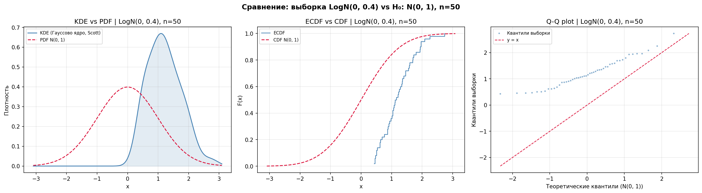 | 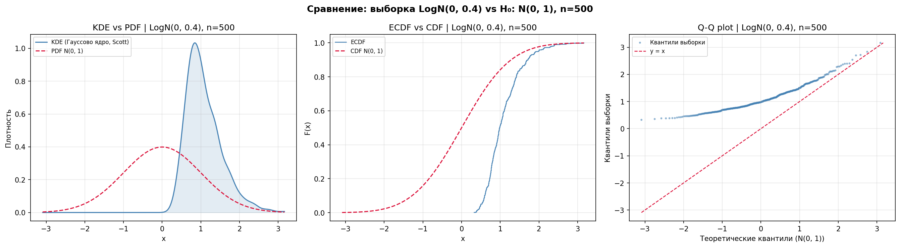 | 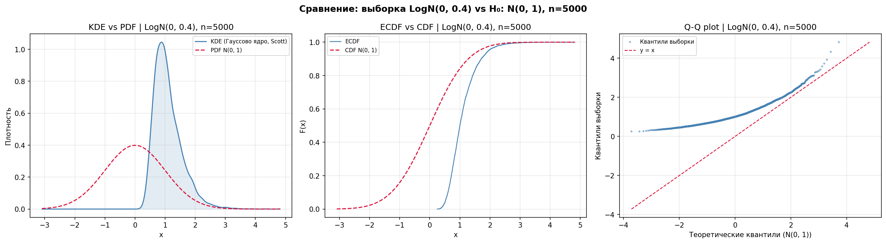 |

---

#### Сценарий 2: H₀: N(0,1) vs t(df=20)

| n | χ² | KS | AD |
|---:|:---:|:---:|:---:|
| 10 | 0.0 | 0.0 | 0.1 |
| 50 | 0.0 | 0.0 | 0.0 |
| 150 | 0.0 | 0.0 | 0.0 |
| 500 | 0.0 | 0.3 | 0.1 |
| 1000 | 0.1 | 0.0 | 0.2 |
| 5000 | 0.5 | 0.1 | **1.0** |

**Чувствительность (min n для power ≥ 0.8):** χ² = не достигнута, KS = не достигнута, **AD = 5000**.

Распределение t(20) очень близко к N(0,1) — отличие проявляется только в более тяжёлых хвостах. Критерий Андерсона–Дарлинга, специально взвешивающий хвосты, единственный достигает мощности 1.0 при n = 5000. Хи-квадрат показывает умеренную мощность 0.5, а Колмогоров–Смирнов практически не обнаруживает отличие (max 0.3).

| n = 50 | n = 500 | n = 5000 |
|:---:|:---:|:---:|
| 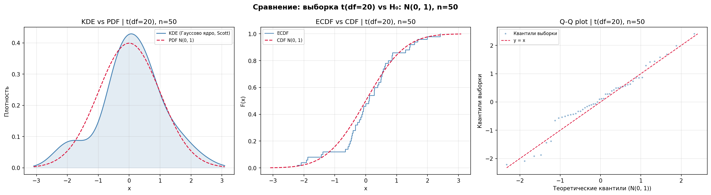 | 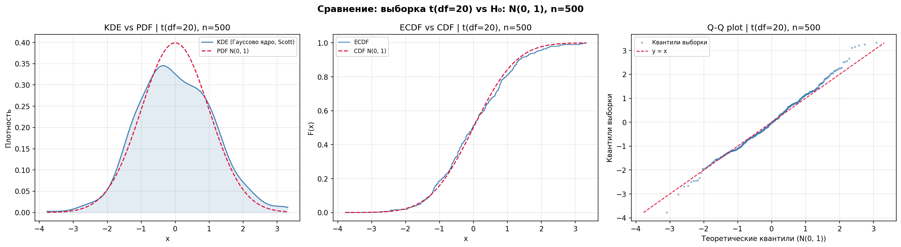 | 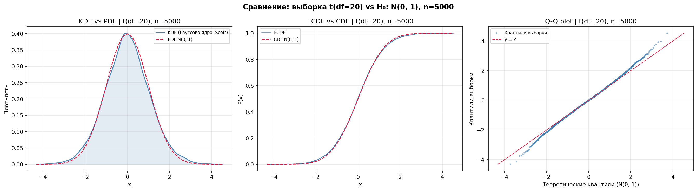 |

---

#### Сценарий 3: H₀: N(0,1) vs N(0,1) + шум (σ_noise = 0.1)

| n | χ² | KS | AD |
|---:|:---:|:---:|:---:|
| 10 | 0.1 | 0.1 | 0.1 |
| 50 | 0.0 | 0.0 | 0.0 |
| 150 | 0.1 | 0.0 | 0.0 |
| 500 | 0.1 | 0.1 | 0.1 |
| 1000 | 0.2 | 0.1 | 0.1 |
| 5000 | 0.2 | 0.2 | 0.2 |

**Чувствительность (min n для power ≥ 0.8):** χ² = не достигнута, KS = не достигнута, AD = не достигнута.

Добавление гауссовского шума с σ = 0.1 к N(0,1) даёт распределение N(0, √(1² + 0.1²)) ≈ N(0, 1.005) — практически неотличимое от N(0,1). Ни один критерий не способен обнаружить столь малое отклонение даже при n = 5000. Мощность не превышает 0.2 ни для одного критерия.

| n = 50 | n = 500 | n = 5000 |
|:---:|:---:|:---:|
| 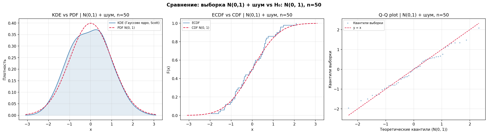 | 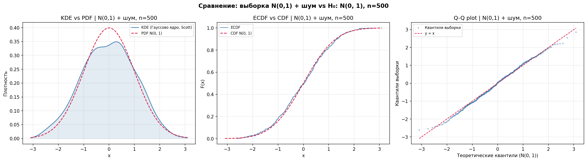 | 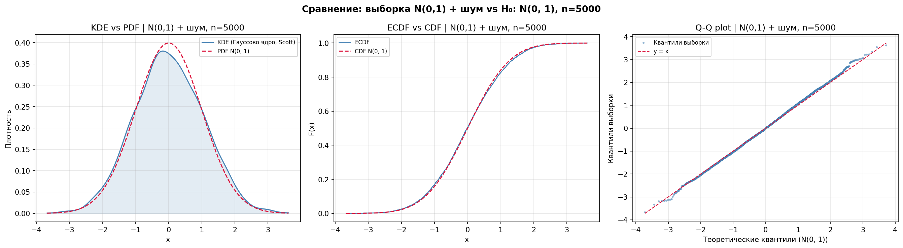 |

---

#### Сценарий 4: H₀: R(0,1) vs Beta(2, 2)

| n | χ² | KS | AD |
|---:|:---:|:---:|:---:|
| 10 | 0.0 | 0.0 | 0.0 |
| 50 | **0.8** | 0.4 | 0.6 |
| 150 | **1.0** | **0.9** | **1.0** |
| 500 | **1.0** | **1.0** | **1.0** |
| 1000 | **1.0** | **1.0** | **1.0** |
| 5000 | **1.0** | **1.0** | **1.0** |

**Чувствительность (min n для power ≥ 0.8):** **χ² = 50**, KS = 150, AD = 150.

Beta(2, 2) — симметричное колоколообразное распределение на [0, 1], отличающееся от R(0, 1) формой (концентрация в центре). Хи-квадрат обнаруживает отличие раньше всех (n = 50), поскольку разбиение на интервалы эффективно улавливает изменение формы плотности. KS и AD достигают порога при n = 150.

| n = 50 | n = 500 | n = 5000 |
|:---:|:---:|:---:|
| 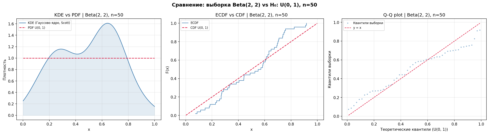 | 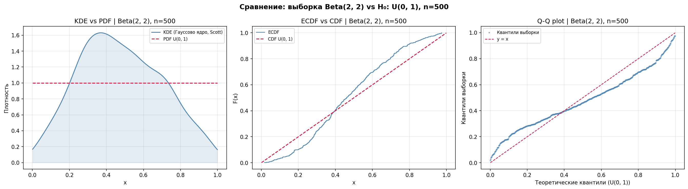 | 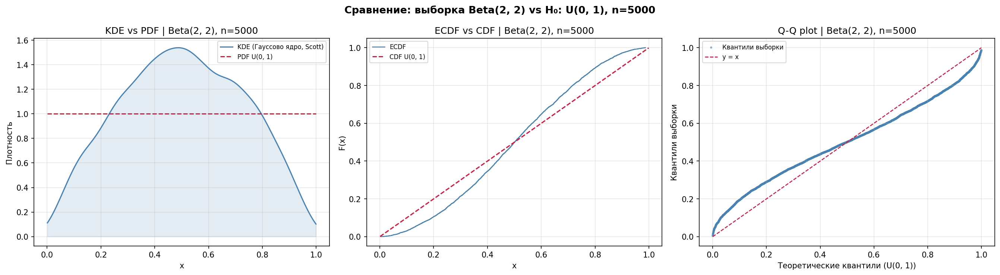 |

---

#### Сценарий 5: H₀: R(0,1) vs R(0,1) + шум (σ_noise = 0.05)

| n | χ² | KS | AD |
|---:|:---:|:---:|:---:|
| 10 | 0.4 | 0.3 | 0.4 |
| 50 | **0.9** | 0.1 | 0.1 |
| 150 | **0.9** | 0.0 | 0.6 |
| 500 | **1.0** | 0.0 | **1.0** |
| 1000 | **1.0** | 0.0 | **1.0** |
| 5000 | **1.0** | **0.9** | **1.0** |

**Чувствительность (min n для power ≥ 0.8):** **χ² = 50**, AD = 500, KS = 5000.

Добавление шума к R(0,1) приводит к «размытию» границ носителя — значения выходят за [0, 1]. Хи-квадрат обнаруживает это раньше всех (n = 50), поскольку выбросы за пределы носителя автоматически приводят к отвержению. Андерсон–Дарлинг, чувствительный к хвостам, достигает порога при n = 500. Колмогоров–Смирнов наименее чувствителен — только при n = 5000.

| n = 50 | n = 500 | n = 5000 |
|:---:|:---:|:---:|
| 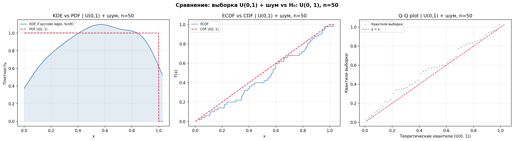 |  | 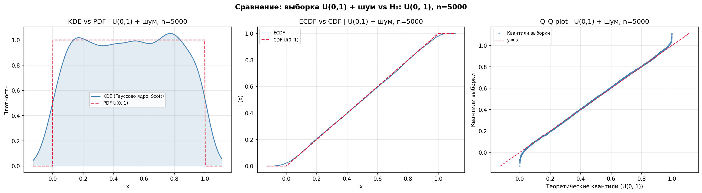 |

---

#### Сценарий 6: H₀: Exp(1) vs Weibull(k=1.3, λ=1)

| n | χ² | KS | AD |
|---:|:---:|:---:|:---:|
| 10 | 0.0 | 0.0 | 0.0 |
| 50 | 0.1 | 0.1 | 0.2 |
| 150 | **0.9** | 0.7 | **0.8** |
| 500 | **1.0** | **1.0** | **1.0** |
| 1000 | **1.0** | **1.0** | **1.0** |
| 5000 | **1.0** | **1.0** | **1.0** |

**Чувствительность (min n для power ≥ 0.8):** χ² = 150, AD = 150, KS = 500.

Weibull(1.3, 1) близок к Exp(1) (при k = 1 Weibull = Exp), но имеет немного другую форму хвоста. Хи-квадрат и Андерсон–Дарлинг обнаруживают отличие при n = 150, Колмогоров–Смирнов — при n = 500.

| n = 50 | n = 500 | n = 5000 |
|:---:|:---:|:---:|
| 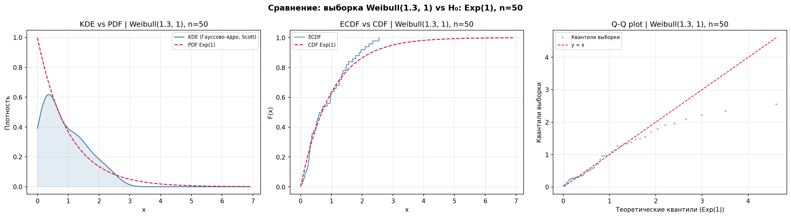 |  |  |

---

#### Сценарий 7: H₀: Exp(1) vs Exp(1) + шум (σ_noise = 0.1)

| n | χ² | KS | AD |
|---:|:---:|:---:|:---:|
| 10 | 0.2 | 0.1 | 0.2 |
| 50 | 0.7 | 0.1 | 0.2 |
| 150 | **0.9** | 0.0 | 0.6 |
| 500 | **1.0** | 0.3 | **1.0** |
| 1000 | **1.0** | 0.1 | **1.0** |
| 5000 | **1.0** | **1.0** | **1.0** |

**Чувствительность (min n для power ≥ 0.8):** **χ² = 150**, AD = 500, KS = 5000.

Шум приводит к появлению отрицательных значений (невозможных для Exp(1)). Хи-квадрат обнаруживает это раньше всех (n = 150) благодаря механизму обработки выбросов за пределами носителя. Андерсон–Дарлинг достигает порога при n = 500, а Колмогоров–Смирнов — только при n = 5000.

| n = 50 | n = 500 | n = 5000 |
|:---:|:---:|:---:|
| 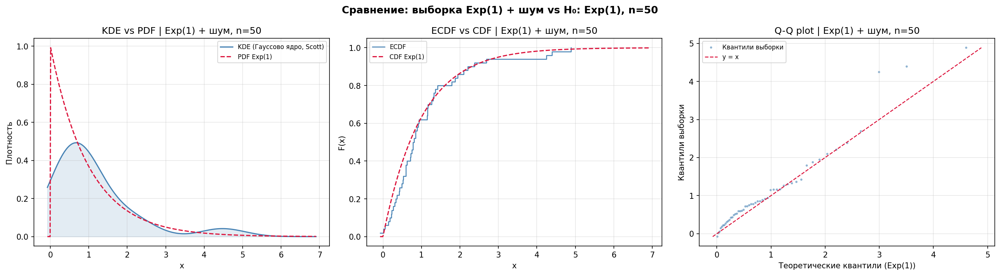 |  | 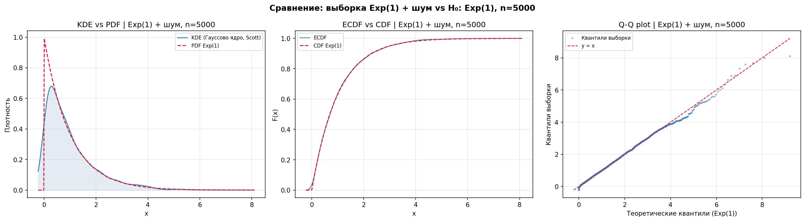 |

---

## 5. Сводная таблица чувствительности

Минимальный объём выборки n, при котором мощность критерия достигает 0.8:

| Сценарий | χ² | KS | AD |
|----------|:---:|:---:|:---:|
| N(0,1) vs LogN(0, 0.4) | 10 | 10 | 10 |
| N(0,1) vs t(df=20) | — | — | 5000 |
| N(0,1) vs N(0,1)+шум | — | — | — |
| R(0,1) vs Beta(2,2) | **50** | 150 | 150 |
| R(0,1) vs R(0,1)+шум | **50** | 5000 | 500 |
| Exp(1) vs Weibull(k=1.3, λ=1) | **150** | 500 | 150 |
| Exp(1) vs Exp(1)+шум | **150** | 5000 | 500 |

«—» означает, что мощность 0.8 не достигнута ни при одном из исследованных объёмов выборки.

---

## 6. Практические рекомендации

### 6.1. Выбор критерия в зависимости от задачи

**Для обнаружения отклонений в хвостах распределения (проверка нормальности, экспоненциальности):**
- **Андерсон–Дарлинг** — наилучший выбор. Единственный критерий, обнаруживший отличие t(df=20) от N(0,1) при n = 5000.

**Для обнаружения изменений формы плотности:**
- **Хи-квадрат Пирсона** — наиболее эффективен. Первым обнаруживает Beta(2,2) vs R(0,1) (n = 50) и выбросы за пределы носителя.

**Для общих случаев:**
- **Колмогоров–Смирнов** — универсальный критерий, не зависящий от параметров группировки. Однако наименее чувствителен к малым отклонениям и к изменениям в хвостах.

### 6.2. Зависимость от объёма выборки

| Диапазон n | Характеристика |
|:---:|---|
| n < 50 | Низкая мощность всех критериев. Надёжно обнаруживаются только радикальные отличия (LogN vs N). |
| 50 ≤ n ≤ 500 | Начинают проявляться различия в чувствительности критериев. χ² лидирует при изменениях формы. |
| n > 500 | Высокая мощность для большинства сценариев. AD выходит на максимум для тонких отличий в хвостах. |

### 6.3. Особенности каждого критерия

**Хи-квадрат Пирсона:**
- Высокая мощность при изменениях формы плотности и нарушениях носителя
- Раннее обнаружение (наименьший min_n в 4 из 7 сценариев)
- Зависимость от числа интервалов (правило Стёрджесса)
- Потеря информации при группировке данных

**Колмогоров–Смирнов:**
- Универсальность и независимость от параметров группировки
- Простота интерпретации (максимальное отклонение CDF)
- Наименьшая чувствительность к малым отклонениям
- Слабая чувствительность к изменениям в хвостах

**Андерсон–Дарлинг:**
- Наивысшая чувствительность к отклонениям в хвостах распределения
- Единственный критерий, обнаруживший t(df=20) vs N(0,1)
- Фиксированное критическое значение (без p-value в данной реализации)
- Ограниченный набор табулированных критических значений

---

## 7. Заключение

Проведённый анализ демонстрирует, что **не существует универсально лучшего критерия согласия**. Выбор должен основываться на:

1. **Характере ожидаемых отклонений:** если предполагаются отличия в хвостах — Андерсон–Дарлинг; если в форме плотности — Хи-квадрат; для общего случая — Колмогоров–Смирнов.
2. **Объёме выборки:** при n < 50 все критерии ненадёжны; при n ≥ 150 большинство сценариев обнаруживается хотя бы одним критерием.
3. **Типе распределения H₀:** для распределений с ограниченным носителем (R(0,1), Exp(1)) Хи-квадрат имеет преимущество за счёт обработки выбросов.
4. **Величине отклонения:** при радикальных отличиях (LogN vs N) все критерии эквивалентны; при тонких отличиях (t(df=20) vs N(0,1), шум) критерии существенно различаются.

**Главный практический вывод:** для надёжного обнаружения малых отклонений рекомендуется применять **комбинацию критериев** — Хи-квадрат для формы и Андерсон–Дарлинг для хвостов — с объёмом выборки не менее 500 наблюдений.

---

*Исследование выполнено на Python3 с использованием библиотек scipy, numpy, pandas, matplotlib. Исходный код: [`main.py`](main.py), [`models.py`](models.py), [`plotting.py`](plotting.py). Результаты: [`result_tables/`](result_tables/). Графики: [`plots/`](plots/).*
