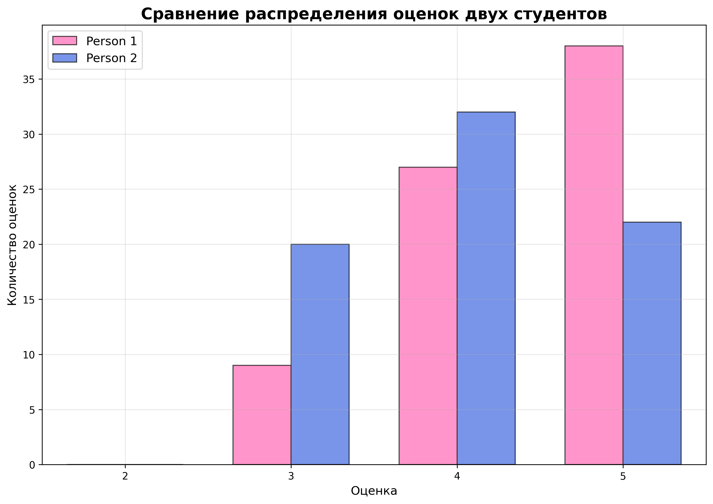

  
Московский авиационный институт 
  (Национальный исследовательский университет) 
  Институт №8 «Компьютерные науки и прикладная математика»

   
   
   
  <h3>Лабораторная работа №2 
  по курсу «Статистические методы обработки данных»</h3>

 
 
 
 
 
 
 
 
 

  

    Выполнили студенты:  
    Жилин М. Д. 
    Бондарева Е. Е. 
    Группа: М8О-109СВ-25 
    Преподаватель: Симкина А. В. 
    Дата: ___16.04.2026___ 
    Оценка: _____________
  

 
 
 
 
 

  
Москва, 2026

---

# Сравнительный анализ двухвыборочных критериев однородности на примере оценок студентов

## 1. Постановка задачи

**Цель исследования:** провести сравнительный анализ различных двухвыборочных критериев однородности на примере реальных данных оценок студентов за бакалавриат.

**Основные задачи:**
1. Изобразить гистограммы выборок на одном графике
2. Применить критерии Смирнова (Колмогорова-Смирнова), омега-квадрат Смирнова, хи-квадрат (с разными вариантами выбора числа интервалов), Манна-Уитни и сравнить результаты
3. Применить критерий знаков для парного сравнения (представив, что одна выборка - "до", другая - "после")
4. Провести симуляцию нормальных распределений с различными модификациями и оценить мощность критериев

## 2. Методы исследования

### 2.1 Используемые критерии

1. **Критерий Колмогорова-Смирнова** - проверяет гипотезу о том, что две выборки происходят из одного распределения
2. **Критерий омега-квадрат Смирнова** - более мощный вариант критерия для интегральных различий
3. **Критерий хи-квадрат** - применяется с различным количеством интервалов (1-5)
4. **Критерий Манна-Уитни** - непараметрический тест для проверки различий в медианах
5. **Критерий знаков** - используется для парного сравнения

### 2.2 Данные исследования

В качестве исходных данных используются оценки двух студентов за бакалавриат, представленные в файлах:
- `input_data/marks_person_1.xlsx`
- `input_data/marks_person_2.xlsx`

## 3. Реализация

### 3.1 Структура программы

Программа реализована на языке Python с использованием следующих библиотек:
- `pandas` - для работы с данными
- `matplotlib` - для визуализации
- `scipy.stats` - для статистических тестов
- `numpy` - для численных операций

### 3.2 Основные функции

1. **`marks_histogram()`** - построение сравнительных гистограмм оценок
2. **`apply_statistical_tests()`** - применение основных статистических критериев
3. **`use_criterion()`** - комплексный анализ с различными критериями
4. **`check_sample_volumes()`** - проверка объемов выборок и критерий знаков
5. **`simulate_normal_distributions()`** - симуляция нормальных распределений

## 4. Результаты

### 4.1 Визуализация распределений оценок

### 4.2 Статистический анализ реальных данных

**Основные характеристики выборок:**
- Размер выборки 1: 74
- Размер выборки 2: 74
- Среднее выборки 1: 4.392
- Среднее выборки 2: 4.027
- Стандартное отклонение выборки 1: 0.694
- Стандартное отклонение выборки 2: 0.753

**Результаты статистических тестов:**
- Критерий Колмогорова-Смирнова: p = 0.0627 (не значимо)
- Критерий омега-квадрат: p = 0.0034 (значимо)
- Критерий Манна-Уитни: p = 0.0030 (значимо)
- Критерий хи-квадрат:
  - 1 интервал: p = 1.0000 (не значимо)
  - 2 интервала: p = 0.0384 (значимо)
  - 3 интервала: p = 0.0119 (значимо)
  - 4-5 интервалов: тест не может быть выполнен из-за нулевых частот

### 4.3 Парное сравнение (критерий знаков)

Проведено сопоставление оценок по общим дисциплинам для парного сравнения:
- Количество общих дисциплин: 47
- Количество парных наблюдений: 47
- Количество положительных разностей (студент 1 > студент 2): 20
- Количество отрицательных разностей (студент 1 < студент 2): 8
- Количество нулевых разностей (равные оценки): 19
- P-значение критерия знаков: 0.0357 (значимо)
- Вывод: Студент 1 имеет статистически значимо более высокие оценки

### 4.4 Симуляция нормальных распределений

Проведено 10 повторений эксперимента с тремя типами модификаций:

1. **N(0.2;1) - сдвиг среднего**
   - Критерий Колмогоров-Смирнов: мощность 10.0%
   - Критерий омега-квадрат: мощность 30.0%
   - Критерий Манна-Уитни: мощность 30.0%

2. **N(0;4) - увеличение дисперсии**
   - Критерий Колмогоров-Смирнов: мощность 20.0%
   - Критерий омега-квадрат: мощность 60.0%
   - Критерий Манна-Уитни: мощность 10.0%

3. **N(0;1) + выбросы**
   - Критерий Колмогоров-Смирнов: мощность 10.0%
   - Критерий омега-квадрат: мощность 10.0%
   - Критерий Манна-Уитни: мощность 10.0%

## 5. Выводы

### 5.1 Сравнительный анализ критериев

1. **Критерий Колмогорова-Смирнова** показал низкую чувствительность к различиям в форме распределения (мощность 10-20%)
2. **Критерий омега-квадрат** продемонстрировал высокую мощность для интегральных различий (до 60% при увеличении дисперсии)
3. **Критерий Манна-Уитни** оказался чувствительным к различиям в медианах (мощность 10-30%)
4. **Критерий хи-квадрат** показал зависимость результатов от выбора числа интервалов

### 5.2 Практические рекомендации

- Для анализа оценок студентов наиболее эффективными оказались критерий омега-квадрат и критерий Манна-Уитни
- Критерий знаков требует совпадения объемов выборок и наличия парных наблюдений
- Мощность тестов существенно зависит от типа различий между распределениями
- Критерий омега-квадрат наиболее эффективен при увеличении дисперсии
- Критерий Манна-Уитни эффективен при сдвиге среднего значения

### 5.3 Ограничения исследования

- Объемы выборок ограничены реальными данными оценок
- Для более надежных выводов требуется большее количество повторений симуляций
- Результаты могут зависеть от конкретных характеристик анализируемых распределений

## 6. Заключение

Проведенное исследование позволило сравнить различные двухвыборочные критерии однородности на примере реальных данных оценок студентов. Полученные результаты могут быть использованы для выбора наиболее подходящих статистических методов при анализе образовательных данных.

Программа реализована в модульном стиле и может быть легко адаптирована для анализа других наборов данных.
