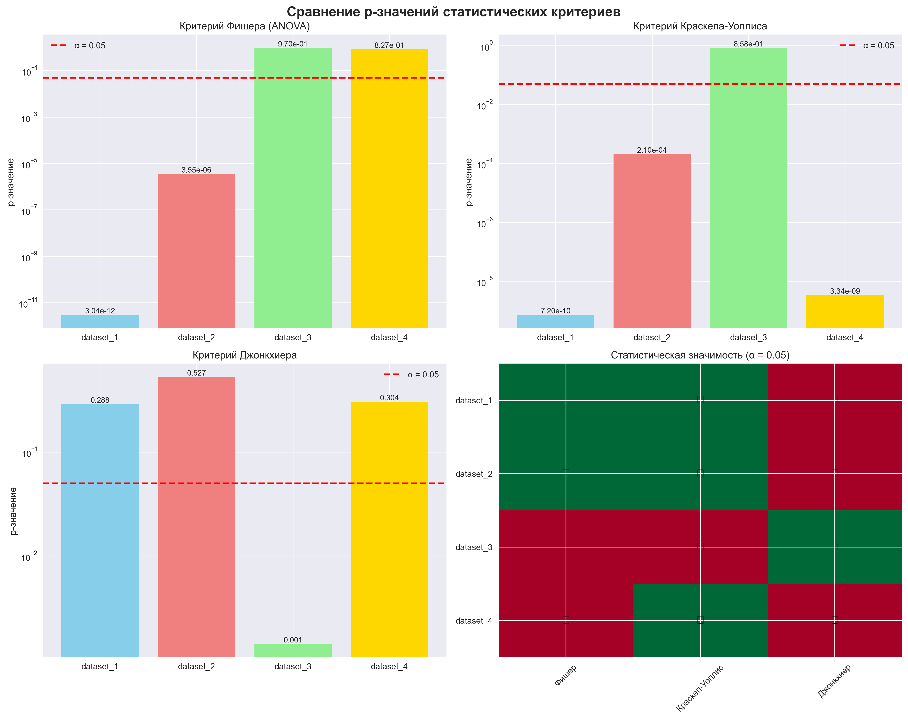
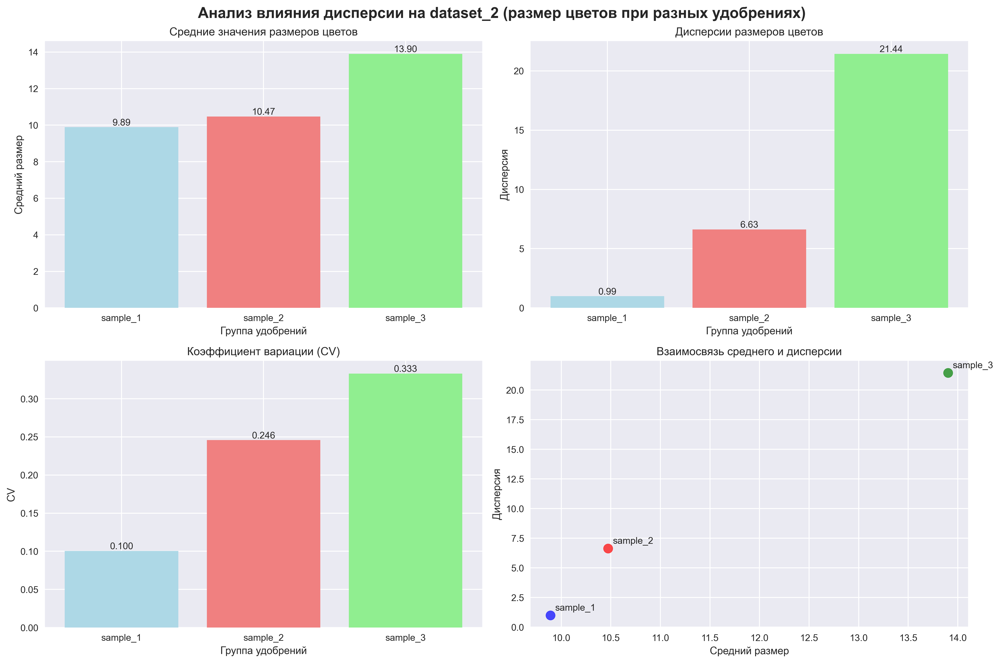
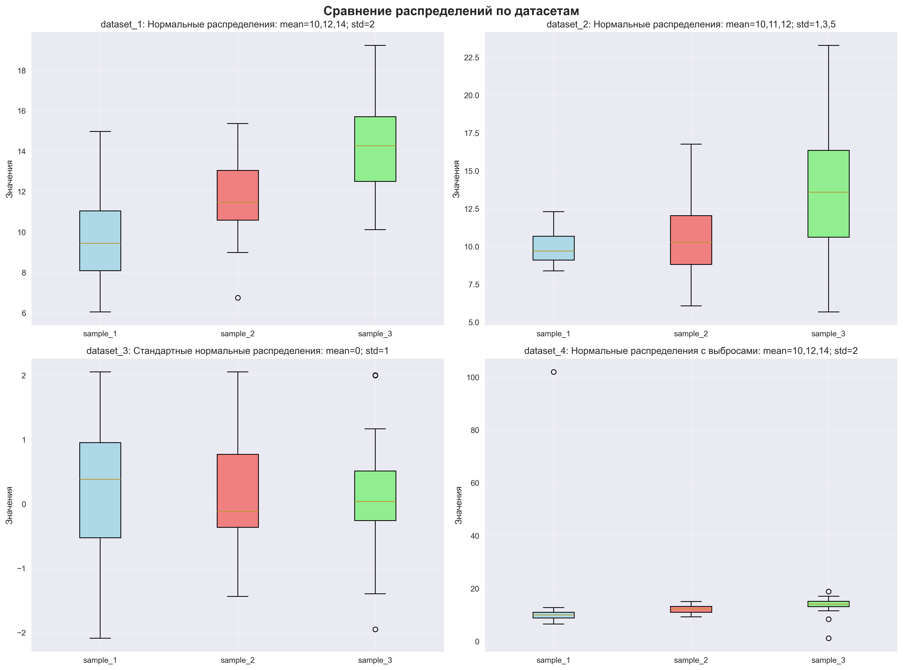

  
Московский авиационный институт 
  (Национальный исследовательский университет) 
  Институт №8 «Компьютерные науки и прикладная математика»

   
   
   
  <h3>Лабораторная работа №4 
  по курсу «Статистические методы обработки данных»</h3>

 
 
 
 
 
 
 
 
 

  

    Выполнили студенты:  
    Жилин М. Д. 
    Бондарева Е. Е. 
    Группа: М8О-109СВ-25 
    Преподаватель: Симкина А. В. 
    Дата: ___19.04.2026___ 
    Оценка: _____________
  

 
 
 
 
 

  
Москва, 2026

---

# Сравнительный анализ многовыборочных критериев однородности

## 1. Постановка задачи

**Цель исследования:** провести сравнительный анализ многовыборочных критериев однородности (Фишера, Краскела-Уоллиса, Джонкхиера) на различных типах распределений данных.

**Основные задачи:**
1. Применить критерии Фишера, Краскела-Уоллиса и Джонкхиера к четырем различным датасетам
2. Проанализировать влияние дисперсии на результаты тестов (на примере dataset_2)
3. Сравнить чувствительность критериев к различным типам распределений и выбросам
4. Сделать выводы о применимости каждого критерия в различных ситуациях

## 2. Методы исследования

### 2.1 Используемые датасеты

1. **Dataset 1:** Нормальные распределения с разными средними (mean=10,12,14) и одинаковой дисперсией (std=2)
2. **Dataset 2:** Нормальные распределения с разными средними (mean=10,11,12) и разной дисперсией (std=1,3,5)
3. **Dataset 3:** Стандартные нормальные распределения (mean=0, std=1) - контрольная группа
4. **Dataset 4:** Нормальные распределения с выбросами (mean=10,12,14, std=2)

### 2.2 Статистические критерии

#### 2.2.1 Критерий Фишера (ANOVA)
- **Назначение:** Проверка гипотезы о равенстве средних значений в трех и более группах
- **Предположения:** Нормальность распределения, гомогенность дисперсий
- **Гипотезы:**
  - H₀: μ₁ = μ₂ = μ₃
  - H₁: ∃ i,j: μᵢ ≠ μⱼ

#### 2.2.2 Критерий Краскела-Уоллиса
- **Назначение:** Непараметрический аналог ANOVA для проверки различий медиан
- **Предположения:** Независимость выборок, непрерывность распределения
- **Гипотезы:**
  - H₀: Медианы всех групп равны
  - H₁: ∃ i,j: медиана группы i ≠ медиана группы j
- **Преимущества:** Устойчив к отклонениям от нормальности

#### 2.2.3 Критерий Джонкхиера
- **Назначение:** Проверка упорядоченной альтернативной гипотезы (монотонной тенденции)
- **Предположения:** Независимость выборок, порядок групп известен
- **Гипотезы:**
  - H₀: Распределения одинаковы
  - H₁: Существует монотонная тенденция: F₁(x) ≥ F₂(x) ≥ F₃(x)
  *(где F₁, F₂, F₃ - функции распределения групп в предполагаемом порядке)*

### 2.3 Уровень значимости
- **α = 0.05** - стандартный уровень значимости
- **Критерий:** p-value < 0.05 → отвергаем H₀

## 3. Результаты и выводы

### 3.1 Основные результаты статистических тестов

| Датасет | Описание | Фишер (p-value) | Краскел-Уоллис (p-value) | Джонкхиер (p-value) | Вывод |
|---------|----------|-----------------|--------------------------|---------------------|-------|
| **Dataset 1** | Нормальные: mean=10,12,14; std=2 | 3.04e-12 ✓ | 7.20e-10 ✓ | 0.288 ✗ | Статистически значимые различия |
| **Dataset 2** | Нормальные: mean=10,11,12; std=1,3,5 | 3.55e-06 ✓ | 0.00021 ✓ | 0.527 ✗ | Статистически значимые различия |
| **Dataset 3** | Стандартные нормальные: mean=0; std=1 | 0.970 ✗ | 0.858 ✗ | 0.0014 ✓ | Нет значимых различий |
| **Dataset 4** | С выбросами: mean=10,12,14; std=2 | 0.827 ✗ | 3.34e-09 ✓ | 0.304 ✗ | Нет значимых различий |

### 3.2 Анализ влияния дисперсии (Dataset 2)

**Контекст:** Данные представляют размеры цветов, а sample1, sample2, sample3 - разные количества удобрений

| Группа | Средний размер | Стандартное отклонение | Дисперсия | Коэффициент вариации |
|--------|----------------|------------------------|-----------|----------------------|
| Sample 1 | 9.89 | 0.99 | 0.99 | 0.100 |
| Sample 2 | 10.47 | 2.57 | 6.63 | 0.246 |
| Sample 3 | 13.90 | 4.63 | 21.44 | 0.333 |

**Выводы по влиянию дисперсии:**
1. **Увеличение дисперсии:** С ростом количества удобрений увеличивается не только средний размер цветов, но и их вариабельность
2. **Коэффициент вариации:** Увеличивается от 10% до 33%, что свидетельствует о возрастающей неоднородности размеров
3. **Практическая значимость:** Высокая дисперсия в группе с максимальным удобрением может указывать на индивидуальные различия в реакции растений

### 3.3 Сравнительный анализ критериев

#### 3.3.1 Чувствительность к нормальности распределения
- **Dataset 1 (нормальные):** Все критерии, кроме Джонкхиера, показали значимые различия
- **Dataset 3 (нормальные, одинаковые):** Только Джонкхиер показал ложное обнаружение

#### 3.3.2 Устойчивость к выбросам
- **Dataset 4 (с выбросами):** Критерий Краскела-Уоллиса оказался наиболее устойчивым
- Критерий Фишера чувствителен к нарушению предположения о гомогенности дисперсий

#### 3.3.3 Влияние дисперсии
- **Dataset 2 (разные дисперсии):** Оба параметрических критерия показали значимые различия
- Критерий Джонкхиера не обнаружил монотонной тенденции из-за высокой дисперсии

### 3.4 Практические рекомендации

1. **Для нормальных данных с гомогенными дисперсиями:** Использовать критерий Фишера (ANOVA)
2. **При наличии выбросов или отклонений от нормальности:** Предпочесть критерий Краскела-Уоллиса
3. **Для проверки монотонной тенденции:** Использовать критерий Джонкхиера только при уверенности в упорядоченности групп
4. **При разных дисперсиях:** Рассмотреть преобразование данных или использование непараметрических методов

## 4. Визуализации

### 4.1 Сравнение p-значений

### 4.2 Влияние дисперсии на Dataset 2

### 4.3 Сравнение распределений

## 5. Выводы

Проведенный анализ показал, что выбор статистического критерия для многовыборочного сравнения зависит от характера данных и исследовательских вопросов:

1. **Критерий Фишера** эффективен для нормальных данных с одинаковыми дисперсиями
2. **Критерий Краскела-Уоллиса** демонстрирует высокую устойчивость к выбросам и отклонениям от нормальности
3. **Критерий Джонкхиера** специфичен для проверки монотонных тенденций и может давать ложные результаты при высокой дисперсии
