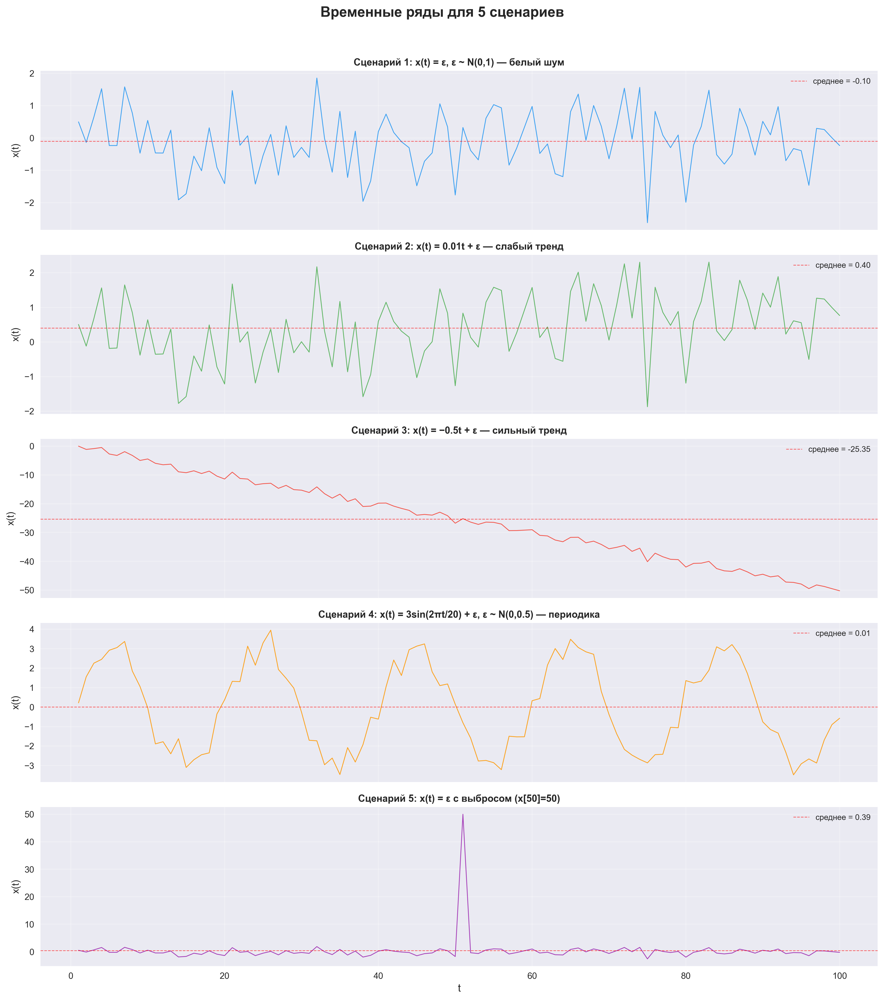
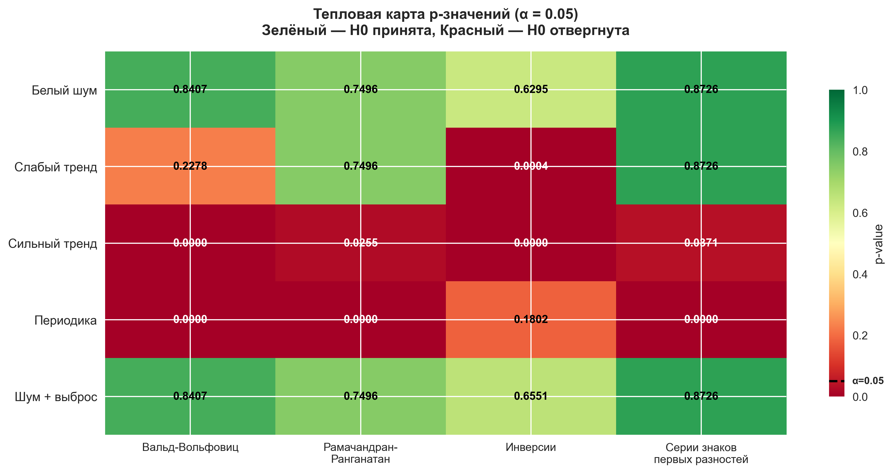
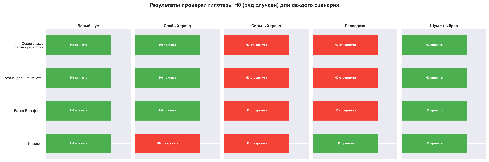
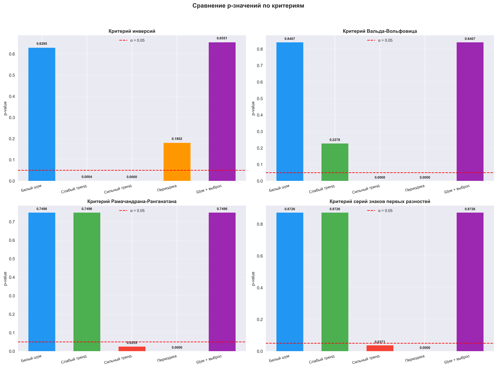

  
Московский авиационный институт 
  (Национальный исследовательский университет) 
  Институт №8 «Компьютерные науки и прикладная математика»

   
   
   
  <h3>Лабораторная работа №5 
  по курсу «Статистические методы обработки данных»</h3>

 
 
 
 
 
 
 
 
 

  

    Выполнили студенты:  
    Жилин М. Д. 
    Бондарева Е. Е. 
    Группа: М8О-109СВ-25 
    Преподаватель: Симкина А. В. 
    Дата: ___01.05.2026___ 
    Оценка: _____________
  

 
 
 
 
 

  
Москва, 2026

---

# Анализ случайности временных рядов с помощью непараметрических критериев

## 1. Постановка задачи

**Цель исследования:** проверить случайность временных рядов с помощью четырёх непараметрических критериев и сравнить их чувствительность к различным типам неслучайности (тренд, периодика, выбросы).

**Основные задачи:**
1. Сгенерировать 5 временных рядов объёма n = 100 для различных сценариев
2. Применить критерий инверсий, сериальный критерий Вальда-Вольфовица, критерий Рамачандрана-Ранганатана и критерий серий знаков первых разностей
3. Визуализировать временные ряды и результаты тестирования
4. Сравнить результаты и сделать выводы о чувствительности критериев

## 2. Описание сценариев

| № | Формула | Описание |
|---|---------|----------|
| 1 | x(t) = ε, ε ~ N(0,1) | Белый шум (контрольный сценарий) |
| 2 | x(t) = 0.01t + ε, ε ~ N(0,1) | Слабый линейный тренд |
| 3 | x(t) = −0.5t + ε, ε ~ N(0,1) | Сильный убывающий тренд |
| 4 | x(t) = 3sin(2πt/20) + ε, ε ~ N(0, 0.5) | Периодическая компонента (T=20) |
| 5 | Сценарий 1 + выброс (x[50] = 50) | Белый шум с единичным выбросом |

## 3. Методы исследования

### 3.1 Критерий инверсий

- **Назначение:** проверка наличия монотонного тренда
- **Статистика:** число инверсий A — пар (i, j), где i < j, но x[i] > x[j]
- **Распределение при H₀:** A ~ N(E[A], D[A]), где E[A] = n(n−1)/4, D[A] = n(n−1)(2n+5)/72
- **H₀:** ряд случаен (нет тренда)
- **H₁:** ряд не случаен (есть тренд)

### 3.2 Сериальный критерий Вальда-Вольфовица

- **Назначение:** проверка случайности через анализ серий относительно медианы
- **Статистика:** число серий R — последовательностей элементов по одну сторону от медианы
- **Распределение при H₀:** R ~ N(E[R], D[R]), где E[R] = 2n₁n₂/n + 1
- **H₀:** ряд случаен
- **H₁:** ряд не случаен

### 3.3 Критерий Рамачандрана-Ранганатана

- **Назначение:** проверка случайности через анализ серий вверх-вниз
- **Статистика:** число серий S — максимальных подпоследовательностей монотонного роста/убывания
- **Распределение при H₀:** S ~ N(E[S], D[S]), где E[S] = (2n−1)/3, D[S] = (16n−29)/90
- **H₀:** ряд случаен
- **H₁:** ряд не случаен

### 3.4 Критерий серий знаков первых разностей

- **Назначение:** проверка случайности через знаки первых разностей d[i] = x[i+1] − x[i]
- **Статистики:** число серий R одинаковых знаков и максимальная длина серии L_max
- **Критерий:** H₀ отвергается, если R выходит за пределы нормального приближения ИЛИ L_max ≥ ⌈log₂(n−1)⌉
- **H₀:** ряд случаен
- **H₁:** ряд не случаен (тренд или периодичность)

### 3.5 Уровень значимости

- **α = 0.05** — стандартный уровень значимости
- **Критерий:** p-value < 0.05 → отвергаем H₀

## 4. Визуализации

### 4.1 Временные ряды

### 4.2 Тепловая карта p-значений

### 4.3 Решения по критериям

### 4.4 Сравнение p-значений

## 5. Результаты и выводы

### 5.1 Сводная таблица результатов

| Сценарий | Инверсии (p-value) | Вальд-Вольфовиц (p-value) | Рамачандран-Ранганатан (p-value) | Серии знаков (p-value) |
|----------|-------------------|---------------------------|----------------------------------|------------------------|
| Белый шум | 0.6295 ✓ | 0.8407 ✓ | 0.7496 ✓ | 0.8726 ✓ |
| Слабый тренд | **0.0004** ✗ | 0.2278 ✓ | 0.7496 ✓ | 0.8726 ✓ |
| Сильный тренд | **0.0000** ✗ | **0.0000** ✗ | **0.0255** ✗ | **0.0371** ✗ |
| Периодика | 0.1802 ✓ | **0.0000** ✗ | **0.0000** ✗ | **0.0000** ✗ |
| Шум + выброс | 0.6551 ✓ | 0.8407 ✓ | 0.7496 ✓ | 0.8726 ✓ |

> ✓ — H₀ принята (ряд случаен), ✗ — H₀ отвергнута (ряд не случаен), α = 0.05

### 5.2 Анализ чувствительности критериев

1. **Критерий инверсий** — наиболее чувствителен к монотонным трендам (обнаружил даже слабый тренд 0.01t с p=0.0004), но не обнаруживает периодичность (p=0.1802), поскольку синусоида симметрична и не создаёт систематического перевеса инверсий
2. **Критерий Вальда-Вольфовица** — эффективен для обнаружения сильного тренда (p≈0) и периодичности (p≈0), но не чувствителен к слабому тренду (p=0.2278)
3. **Критерий Рамачандрана-Ранганатана** — хорошо обнаруживает периодичность (p≈0) и сильный тренд (p=0.0255), но не чувствителен к слабому тренду (p=0.7496)
4. **Критерий серий знаков первых разностей** — наиболее мощный для периодики (p≈0, L_max=10 ≥ L_crit=7), обнаруживает сильный тренд (p=0.0371), но не чувствителен к слабому тренду

### 5.3 Общие выводы

- **Белый шум (сценарий 1):** все критерии корректно принимают H₀ — ряд действительно случаен
- **Слабый тренд (сценарий 2):** только критерий инверсий обнаружил неслучайность (p=0.0004), остальные критерии не чувствительны к столь малому наклону. Это объясняется тем, что критерий инверсий напрямую считает нарушения порядка, что делает его наиболее мощным для обнаружения монотонных трендов
- **Сильный тренд (сценарий 3):** все 4 критерия уверенно отвергают H₀ — сильный линейный тренд легко обнаруживается любым методом
- **Периодика (сценарий 4):** 3 из 4 критериев обнаружили неслучайность. Критерий инверсий не обнаружил периодику, поскольку синусоида не создаёт монотонного тренда. Критерии, основанные на сериях, эффективно выявляют периодическую структуру
- **Шум + выброс (сценарий 5):** ни один критерий не отверг H₀ — единичный выброс практически не влияет на ранговые и знаковые характеристики ряда
