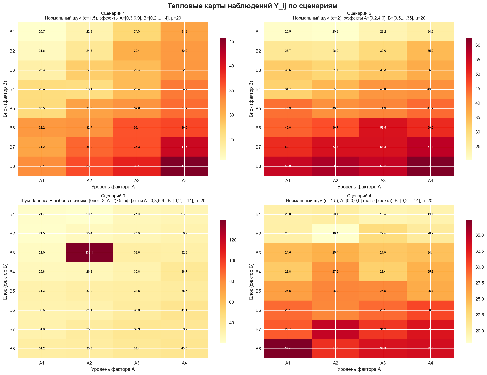
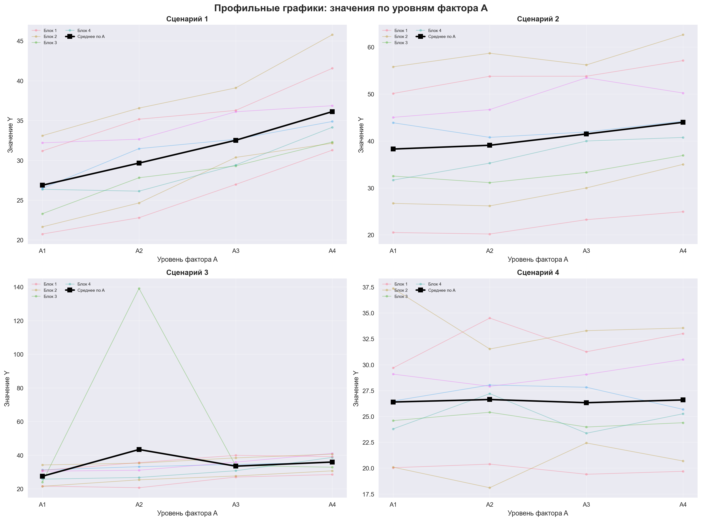
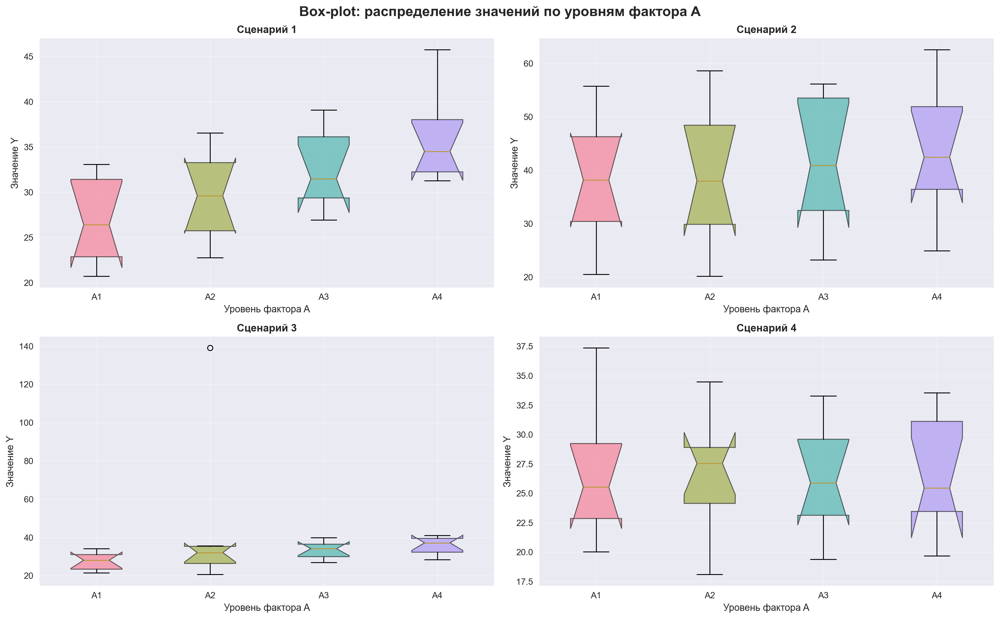
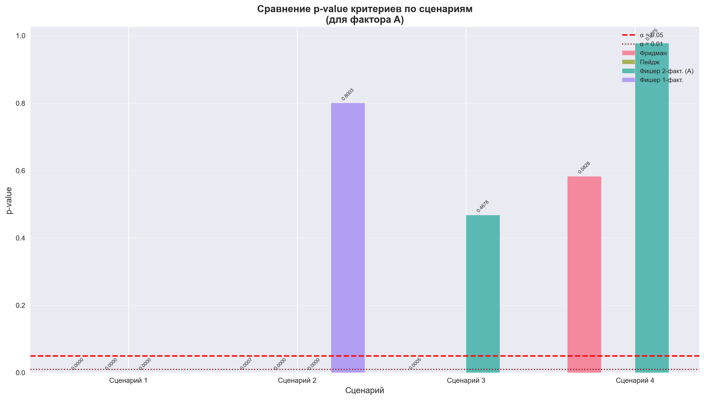
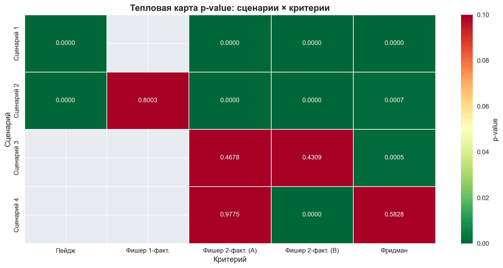
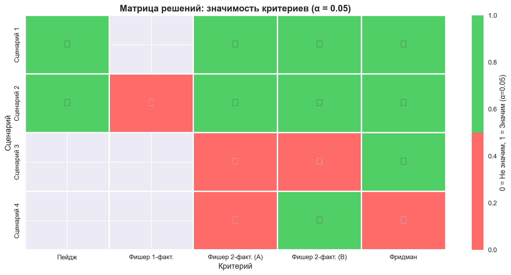
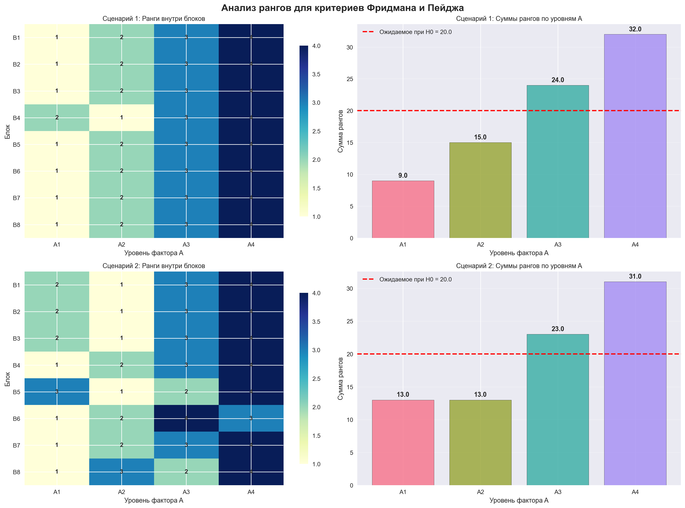
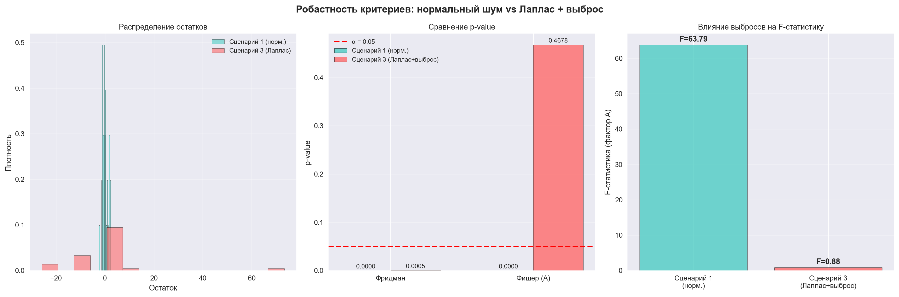
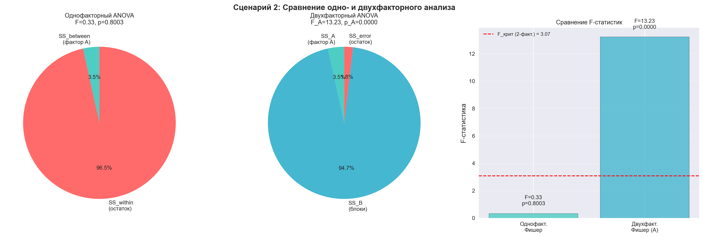

  
Московский авиационный институт 
  (Национальный исследовательский университет) 
  Институт №8 «Компьютерные науки и прикладная математика»

   
   
   
  <h3>Лабораторная работа №6 
  по курсу «Статистические методы обработки данных»</h3>

 
 
 
 
 
 
 
 
 

  

    Выполнили студенты:  
    Жилин М. Д. 
    Бондарева Е. Е. 
    Группа: М8О-109СВ-25 
    Преподаватель: Симкина А. В. 
    Дата: ___01.05.2026___ 
    Оценка: _____________
  

 
 
 
 
 

  
Москва, 2026

---

# Двухфакторный дисперсионный анализ: сравнение критериев Фридмана, Пейджа и Фишера

## 1. Постановка задачи

**Цель исследования:** сравнить критерии двухфакторного дисперсионного анализа (Фридмана, Пейджа, Фишера) на различных сценариях и понять, когда двухфакторный анализ даёт преимущество перед однофакторным.

**Основные задачи:**
1. Сгенерировать данные по двухфакторной модели для 4 сценариев (нормальный шум, сильный мешающий фактор, тяжёлые хвосты с выбросом, нулевой эффект)
2. Применить критерии Фридмана и двухфакторного Фишера ко всем сценариям
3. Применить критерий Пейджа к сценариям с упорядоченной альтернативой (1 и 2)
4. Для сценария 2 сравнить однофакторный и двухфакторный критерий Фишера
5. Визуализировать данные и результаты тестирования
6. Сравнить робастность критериев и сделать выводы о применимости

## 2. Описание математической модели

### 2.1 Двухфакторная модель отклика

$$Y_{ij} = \mu + \alpha_i + \beta_j + \varepsilon_{ij}$$

где:
- $\mu$ — общее среднее
- $\alpha_i$ — эффект главного фактора A ($i = 1, \ldots, k$, $k = 4$)
- $\beta_j$ — эффект мешающего фактора B ($j = 1, \ldots, n$, $n = 8$)
- $\varepsilon_{ij}$ — случайная ошибка

### 2.2 Описание сценариев

| № | Эффекты A (α) | Эффекты B (β) | Шум (ε) | μ | Особенности |
|---|---------------|---------------|---------|---|-------------|
| 1 | 0, +3, +6, +9 | 0, +2, +4, +6, +8, +10, +12, +14 | N(0, 1.5) | 20 | Базовый сценарий |
| 2 | 0, +2, +4, +6 | 0, +5, +10, +15, +20, +25, +30, +35 | N(0, 2) | 20 | Сильный мешающий фактор B |
| 3 | 0, +3, +6, +9 | 0, +2, +4, +6, +8, +10, +12, +14 | Laplace(0, 1.5) + выброс ×5 | 20 | Тяжёлые хвосты + выброс |
| 4 | 0, 0, 0, 0 | 0, +2, +4, +6, +8, +10, +12, +14 | N(0, 1.5) | 20 | H₀ верна (нет эффекта A) |

## 3. Методы исследования

### 3.1 Критерий Фридмана

- **Назначение:** непараметрическая проверка различий между уровнями фактора A с учётом блочной структуры (фактор B)
- **Статистика:** $\chi^2 = \frac{12}{nk(k+1)} \sum_{i=1}^{k} R_i^2 - 3n(k+1)$, где $R_i$ — сумма рангов $i$-го уровня A по всем блокам
- **Распределение при H₀:** $\chi^2$ с $k-1$ степенями свободы
- **H₀:** эффекты всех уровней фактора A одинаковы ($\alpha_1 = \alpha_2 = \ldots = \alpha_k$)
- **H₁:** существуют различия между уровнями A
- **Особенности:** работает с рангами внутри блоков, робастен к выбросам и нарушениям нормальности

### 3.2 Критерий Пейджа

- **Назначение:** проверка упорядоченной альтернативы (монотонного возрастания эффектов A)
- **Статистика:** $L = \sum_{i=1}^{k} i \cdot R_i$, где $R_i$ — сумма рангов $i$-го уровня A
- **Нормальное приближение:** $Z = \frac{L - E[L]}{\sqrt{Var[L]}}$, где $E[L] = \frac{nk(k+1)^2}{4}$, $Var[L] = \frac{n k^2 (k+1)(k^2-1)}{144}$
- **H₀:** эффекты всех уровней фактора A одинаковы
- **H₁:** $\alpha_1 \leq \alpha_2 \leq \ldots \leq \alpha_k$ (хотя бы одно неравенство строгое)
- **Особенности:** мощнее Фридмана при известном порядке уровней, односторонний тест

### 3.3 Двухфакторный критерий Фишера (ANOVA без повторений)

- **Назначение:** параметрическая проверка значимости факторов A и B
- **Разложение:** $SS_{total} = SS_A + SS_B + SS_{error}$
- **F-статистики:**
  - Фактор A: $F_A = \frac{MS_A}{MS_{error}}$, $df_A = k-1$, $df_{error} = (k-1)(n-1)$
  - Фактор B: $F_B = \frac{MS_B}{MS_{error}}$, $df_B = n-1$
- **H₀:** $\alpha_1 = \alpha_2 = \ldots = \alpha_k = 0$
- **H₁:** $\exists i: \alpha_i \neq 0$
- **Предположения:** нормальность ошибок, гомоскедастичность, аддитивность модели

### 3.4 Однофакторный критерий Фишера (one-way ANOVA)

- **Назначение:** проверка различий между уровнями A без учёта блочной структуры
- **Разложение:** $SS_{total} = SS_{between} + SS_{within}$
- **F-статистика:** $F = \frac{MS_{between}}{MS_{within}}$, $df_{between} = k-1$, $df_{within} = N-k$
- **Ключевое отличие от двухфакторного:** $SS_{within} = SS_B + SS_{error}$, т.е. вариация блоков «смешивается» с остаточной дисперсией

### 3.5 Уровень значимости

- **α = 0.05** — стандартный уровень значимости
- **Критерий:** p-value < 0.05 → отвергаем H₀

## 4. Визуализации

### 4.1 Тепловые карты наблюдений

### 4.2 Профильные графики

### 4.3 Box-plot по уровням фактора A

### 4.4 Сравнение p-value критериев

### 4.5 Тепловая карта p-value

### 4.6 Матрица решений

### 4.7 Анализ рангов (для критериев Фридмана и Пейджа)

### 4.8 Робастность критериев: нормальный шум vs Лаплас + выброс

### 4.9 Сравнение одно- и двухфакторного анализа (Сценарий 2)

## 5. Результаты и выводы

### 5.1 Сводная таблица результатов

| Сценарий | Критерий | Статистика | p-value | Значим (α=0.05) |
|----------|----------|------------|---------|-----------------|
| **Сценарий 1** | Фридман | χ² = 22.95 | **4.14e-05** | ✓ Да |
| | Пейдж | L = 239.0, Z = 4.78 | **8.92e-07** | ✓ Да |
| | Фишер 2-факт. (A) | F = 63.79 | **1.01e-10** | ✓ Да |
| | Фишер 2-факт. (B) | F = 44.27 | **3.62e-11** | ✓ Да |
| **Сценарий 2** | Фридман | χ² = 17.10 | **6.74e-04** | ✓ Да |
| | Пейдж | L = 232.0, Z = 3.92 | **4.44e-05** | ✓ Да |
| | Фишер 2-факт. (A) | F = 13.23 | **4.52e-05** | ✓ Да |
| | Фишер 2-факт. (B) | F = 155.17 | **1.11e-16** | ✓ Да |
| | Фишер 1-факт. | F = 0.33 | 0.8003 | ✗ Нет |
| **Сценарий 3** | Фридман | χ² = 17.70 | **5.07e-04** | ✓ Да |
| | Фишер 2-факт. (A) | F = 0.88 | 0.4678 | ✗ Нет |
| | Фишер 2-факт. (B) | F = 1.04 | 0.4309 | ✗ Нет |
| **Сценарий 4** | Фридман | χ² = 1.95 | 0.5828 | ✗ Нет |
| | Фишер 2-факт. (A) | F = 0.07 | 0.9775 | ✗ Нет |
| | Фишер 2-факт. (B) | F = 37.57 | **1.76e-10** | ✓ Да |

> ✓ — H₀ отвергнута (эффект обнаружен), ✗ — H₀ принята (эффект не обнаружен), α = 0.05

### 5.2 Сравнение однофакторного и двухфакторного анализа (Сценарий 2)

| Показатель | Однофакторный ANOVA | Двухфакторный ANOVA |
|------------|---------------------|---------------------|
| SS фактора A | 158.43 | 158.43 |
| SS остатка | **4418.13** | **83.80** |
| SS блоков (B) | — | 4334.33 |
| F-статистика (A) | **0.33** | **13.23** |
| p-value (A) | **0.8003** | **4.52e-05** |
| Решение | ✗ Не значим | ✓ Значим |

**Ключевое наблюдение:** SS_within однофакторного ANOVA = SS_B + SS_error двухфакторного. Блоки объясняют **98.1%** внутригрупповой вариации. Двухфакторный анализ «поглощает» эту вариацию, уменьшая остаточную дисперсию в **52.7 раза** (с 4418.13 до 83.80) и увеличивая F-статистику в **39.5 раз** (с 0.33 до 13.23).

**Вывод:** при наличии сильного мешающего фактора однофакторный ANOVA не способен обнаружить эффект главного фактора, тогда как двухфакторный ANOVA уверенно его выявляет.

### 5.3 Анализ робастности критериев (Сценарий 3)

**Контекст:** распределение Лапласа имеет более тяжёлые хвосты, чем нормальное. Дополнительно в ячейке (блок 3, уровень A=2) значение увеличено в 5 раз (выброс = 139.09).

| Критерий | Сценарий 1 (норм.) | Сценарий 3 (Лаплас + выброс) | Устойчивость |
|----------|---------------------|-------------------------------|--------------|
| Фридман | p = 4.14e-05 ✓ | p = 5.07e-04 ✓ | **Устойчив** |
| Фишер (A) | p = 1.01e-10 ✓ | p = 0.4678 ✗ | **Не устойчив** |

**Объяснение:** Выброс резко увеличивает SS_error (с 41.27 до 8261.23 — в **200 раз**), что «размывает» F-статистику Фишера. Критерий Фридмана работает с рангами, поэтому выброс влияет только на ранг одного наблюдения, не искажая общую картину.

### 5.4 Контроль ошибки I рода (Сценарий 4)

При нулевом эффекте фактора A ($\alpha = [0, 0, 0, 0]$) оба критерия корректно не отвергают H₀:
- Фридман: p = 0.5828 ✗
- Фишер (A): p = 0.9775 ✗

При этом фактор B (блоки) корректно обнаруживается Фишером (p = 1.76e-10 ✓), что подтверждает правильность разложения дисперсии.

### 5.5 Сравнение критериев Фридмана и Пейджа

| Сценарий | Фридман (p-value) | Пейдж (p-value) | Пейдж мощнее? |
|----------|-------------------|-----------------|---------------|
| 1 | 4.14e-05 | **8.92e-07** | Да (в 46 раз) |
| 2 | 6.74e-04 | **4.44e-05** | Да (в 15 раз) |

Критерий Пейджа даёт существенно меньшие p-value, поскольку использует дополнительную информацию о предполагаемом порядке уровней A. Это делает его более мощным при верной упорядоченной альтернативе.

## 6. Общие выводы

### 6.1 Когда двухфакторный анализ лучше однофакторного

Двухфакторный анализ даёт преимущество, когда в данных присутствует мешающий фактор (блочная структура). Чем сильнее эффект мешающего фактора, тем больше выигрыш. В сценарии 2 блоки объясняют 98.1% внутригрупповой вариации — без их учёта эффект главного фактора полностью «тонет» в шуме блоков.

### 6.2 Для каких ситуаций какие критерии лучше

1. **Данные нормальные, нет выбросов** → Двухфакторный критерий Фишера (максимальная мощность, точные p-value)
2. **Есть выбросы или тяжёлые хвосты** → Критерий Фридмана (робастность к нарушениям нормальности, работает с рангами)
3. **Известен порядок уровней фактора A** → Критерий Пейджа (мощнее Фридмана за счёт использования информации о порядке)
4. **Нет блочной структуры** → Однофакторный Фишер (но при наличии скрытого мешающего фактора теряем мощность)

### 6.3 Практические рекомендации

- Всегда проверяйте предпосылки параметрических тестов (нормальность, гомоскедастичность)
- При сомнениях в нормальности используйте непараметрические критерии (Фридман, Пейдж)
- Если есть основания предполагать монотонный тренд в уровнях фактора — используйте Пейджа вместо Фридмана
- Учёт блочной структуры (двухфакторный анализ) критически важен при наличии мешающих факторов — игнорирование блоков может привести к ложноотрицательным результатам
